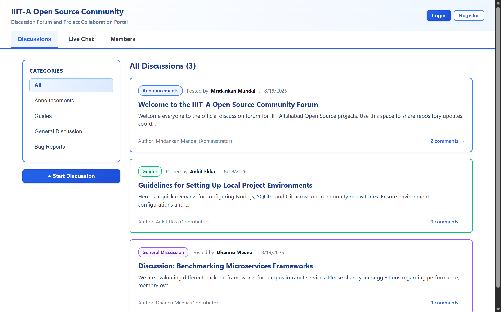
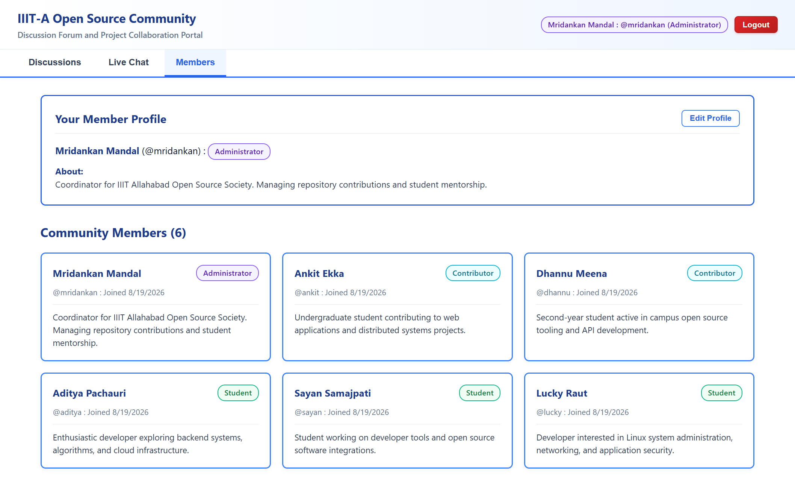
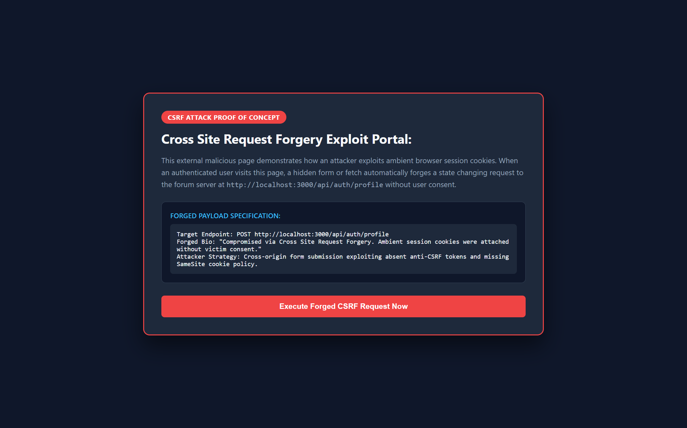
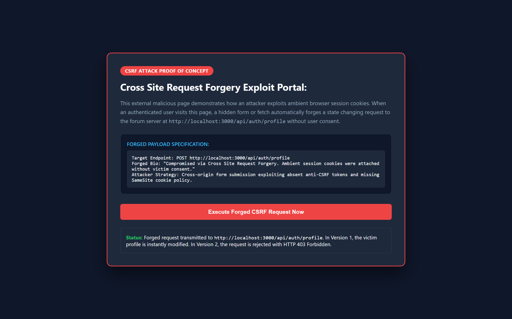
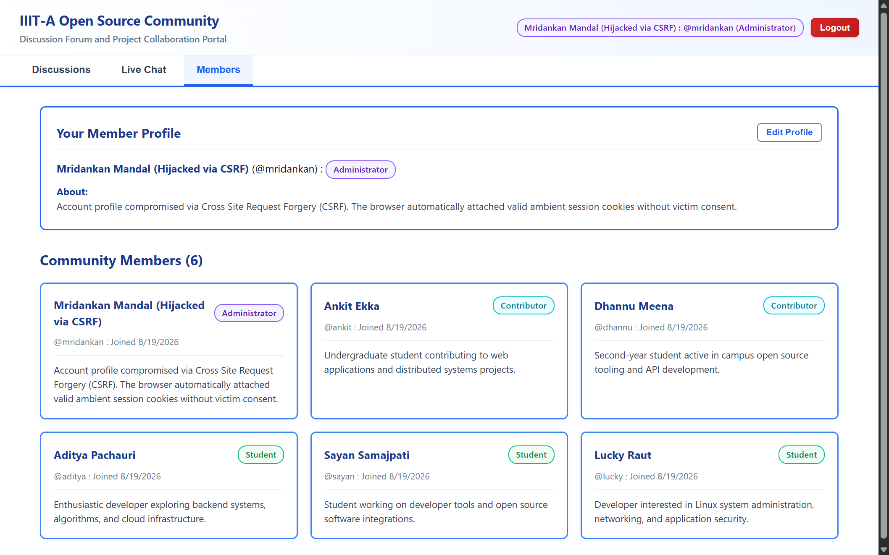

# IIITA Open Source Community Forum:

### Group Members:
1. Mridankan Mandal: IIB2024017.
2. Aditya Pachauri: IIB2024001.
3. Ankit Ekka: IIB2024012.
4. Dhannu Ram Meena: IIB2024033.

## 1. Project Overview:
1. This project is a fullstack community chatting and discussion forum designed for the IIIT Allahabad Open Source Community.
2. The web application allows students, faculty members, and project coordinators to create discussion threads, leave comments, participate in live community chats, and manage member profiles.
3. This directory represents Version 1 of the platform, which contains an intentional Cross Site Request Forgery vulnerability for educational security analysis.

## 2. Technology Stack:
1. Backend: Node.js with Express framework for REST API routing and session management.
2. Database: Embedded SQLite 3 database using `node:sqlite` storing records in `server/forum.db`.
3. Frontend: React framework bundled via Vite into static assets served directly by Express.
4. User Interface: Clean, professional white theme with vibrant colored card borders, custom badges, and zero emojis.

## 3. Core System Features:
1. User Authentication: Registration and login using username and password credentials.
2. Categorized Discussions: Forum categories for Announcements, Guides, General Discussion, and Bug Reports.
3. Interactive Comment Threads: Users can read and post replies on any community discussion.
4. Realtime Community Chat: Live messaging stream with automatic message polling.
5. Member Directory: Public member profiles displaying user roles and editable biographies.

## 4. Preconfigured Community Accounts:
1. Mridankan Mandal: Username is `mridankan` and password is `mridankan123` with `Administrator` role.
2. Ankit Ekka: Username is `ankit` and password is `ankit123` with `Contributor` role.
3. Dhannu Meena: Username is `dhannu` and password is `dhannu123` with `Contributor` role.
4. Aditya Pachauri: Username is `aditya` and password is `aditya123` with `Student` role.
5. Sayan Samajpati: Username is `sayan` and password is `sayan123` with `Student` role.
6. Lucky Raut: Username is `lucky` and password is `lucky123` with `Student` role.

## 5. Local Setup and Installation:
1. Prerequisites: Ensure Node.js version 18 or higher and npm are installed on the system.
2. Installation: Open terminal in this folder and execute.
```bash
npm install
```
3. Client Build: Compile frontend assets by executing.
```bash
npm run build
```
4. Start Application: Launch the server by executing.
```bash
npm start
```
5. Access Portal: Open `http://localhost:3000` in your web browser.

## 6. Visual Interface and CSRF Attack Demonstration:

### 6.1 Community Discussions Portal:

1. The primary discussion dashboard displays all published community topics, categorized sections, and discussion statistics.

### 6.2 Authentic Member Profile Before Exploitation:

1. The authentic profile of Administrator Mridankan Mandal displays legitimate credentials and society coordinator details.

### 6.3 Attacker Deceptive CSRF Web Portal:

1. The attacker hosts an external webpage containing a hidden HTML form that targets the authenticated profile endpoint.

### 6.4 Cross Origin Forged Request Execution:

1. When the logged in victim visits the malicious page, the browser automatically attaches ambient session cookies to submit the unauthorized state change.

### 6.5 Compromised Victim Profile After CSRF Exploitation:

1. The administrator biography is hijacked and altered on the live forum platform without user consent.

### 6.6 Realtime Community Chat Channel:

1. The realtime chat interface allows logged in members to send instant updates across the campus developer network.

## 7. Vulnerability Documentation:
1. Please inspect `Vulnerable.md` for the complete exploitation walkthrough, code analysis, and payload examples.
