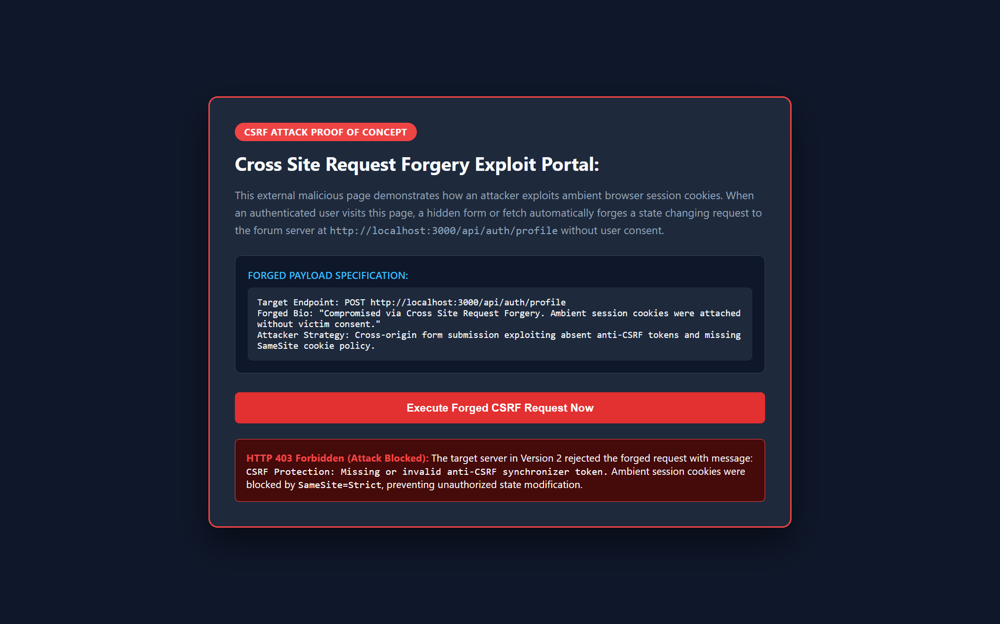
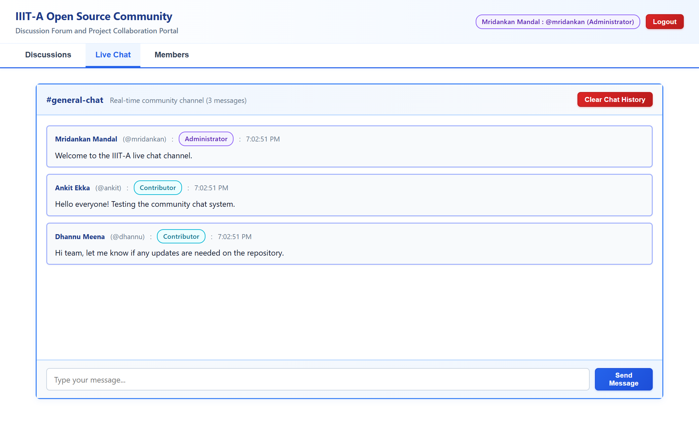

# IIITA Open Source Community Forum Version 2:

### Group Members:
1. Mridankan Mandal: IIB2024017.
2. Aditya Pachauri: IIB2024001.
3. Ankit Ekka: IIB2024012.
4. Dhannu Ram Meena: IIB2024033.

## 1. Project Overview:
1. This project represents Version 2 of the fullstack community discussion and chatting forum built for the IIIT Allahabad Open Source Community.
2. In this version, the Cross Site Request Forgery vulnerability present in Version 1 has been completely mitigated through multilayered defense mechanisms.
3. The platform allows students, contributors, and faculty coordinators to safely publish posts, submit comments, and chat in realtime without security risks.

## 2. Implemented Defense Architecture:
1. Cryptographic Anti CSRF Synchronizer Tokens: Generation of unpredictable random tokens per authenticated session that must accompany every state changing request via the CSRF token header.
2. Strict SameSite Cookie Hardening: Setting `sameSite: 'strict'` and `httpOnly: true` attributes on authentication session cookies to block ambient cookie attachment on cross origin requests.
3. Origin and Referer Request Header Verification: Enforcement of middleware that verifies incoming request `Origin` and `Referer` headers against whitelisted trusted application origins.

## 3. Technology Stack:
1. Backend: Node.js with Express framework for REST API routing and security middleware.
2. Database: Embedded SQLite 3 database using `node:sqlite` storing records in `server/forum.db`.
3. Frontend: React framework bundled via Vite with automatic Anti CSRF token injection.
4. User Interface: Professional white theme with full colored card borders, custom role badges, and zero emojis.

## 4. Preconfigured Community Accounts:
1. Mridankan Mandal: Username is `mridankan` and password is `mridankan123` with `Administrator` role.
2. Ankit Ekka: Username is `ankit` and password is `ankit123` with `Contributor` role.
3. Dhannu Meena: Username is `dhannu` and password is `dhannu123` with `Contributor` role.
4. Aditya Pachauri: Username is `aditya` and password is `aditya123` with `Student` role.
5. Sayan Samajpati: Username is `sayan` and password is `sayan123` with `Student` role.
6. Lucky Raut: Username is `lucky` and password is `lucky123` with `Student` role.

## 5. Local Setup and Installation:
1. Prerequisites: Ensure Node.js version 18 or higher and npm are installed on the system.
2. Installation: Open terminal in this folder and execute.
```bash
npm install
```
3. Client Build: Compile frontend assets by executing.
```bash
npm run build
```
4. Start Application: Launch the server by executing.
```bash
npm start
```
5. Access Portal: Open `http://localhost:3000` in your web browser.

## 6. Visual Interface and Defense Verification:

### 6.1 Community Discussions Dashboard:

1. The main forum dashboard provides a clean overview of community discussions and category navigation.

### 6.2 Authentic Member Profiles Directory:

1. Public member profiles list community contributors, administrators, and students with protected session cookies.

### 6.3 Cross Origin CSRF Attack Blocked by Server Defense:

1. The server rejects the forged cross origin request with HTTP 403 Forbidden due to missing synchronizer tokens and Origin header mismatch.

### 6.4 Protected Victim Profile After Failed CSRF Exploit:

1. The victim administrator biography remains completely unchanged and secure on the live community platform.

### 6.5 Realtime Community Chat Channel:

1. Community members communicate in realtime within protected chat channels defended by Anti CSRF middleware.

## 7. Security Defense Documentation:
1. Please inspect `CSRFAttackDefense.md` for a detailed breakdown of all implemented defenses, source code references, and attack neutralization examples.
