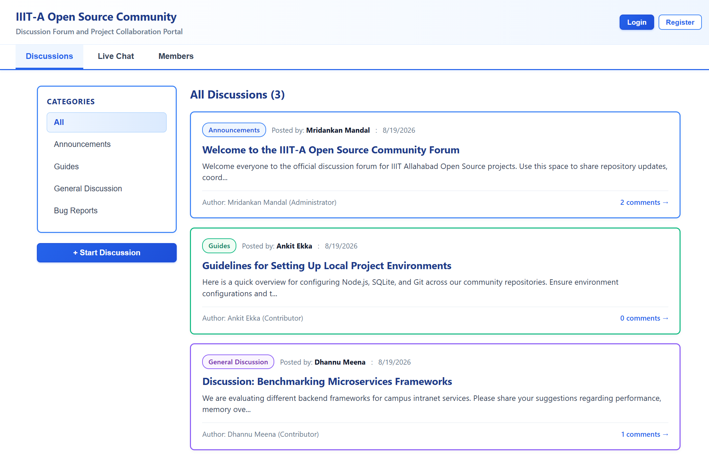
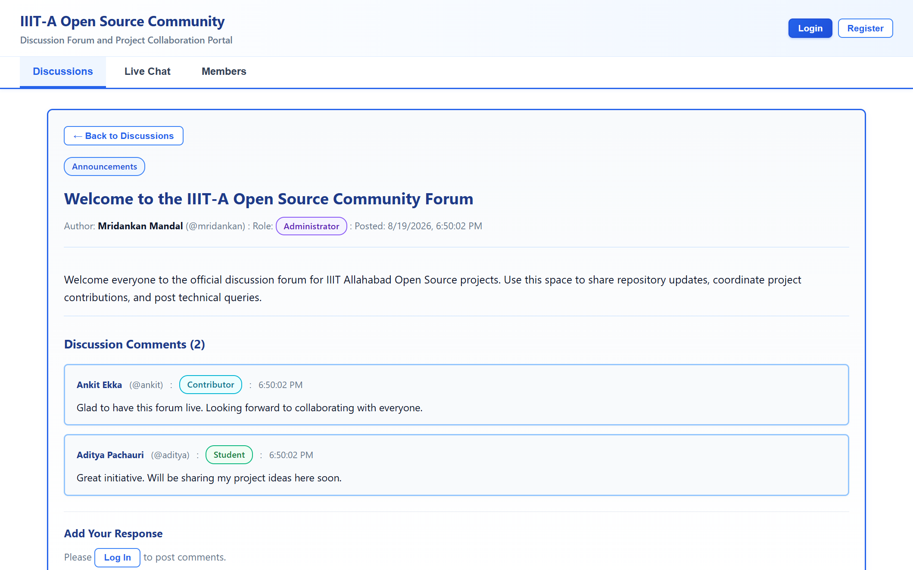
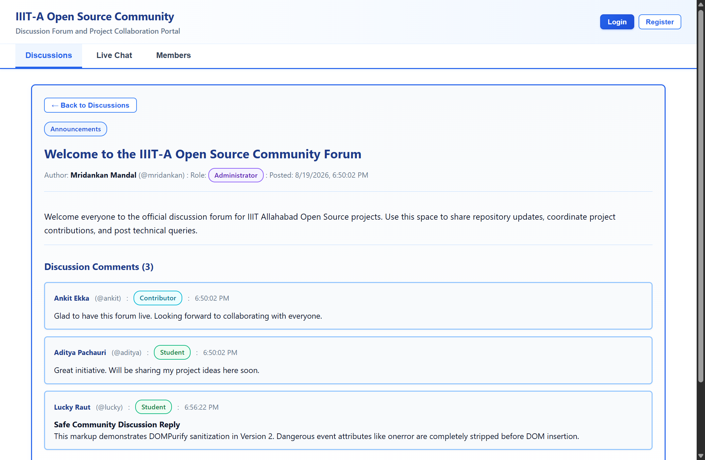
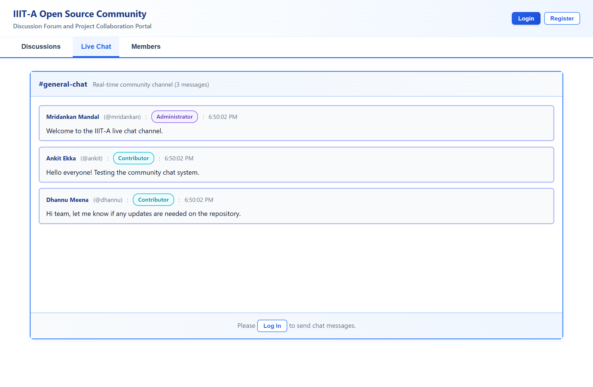
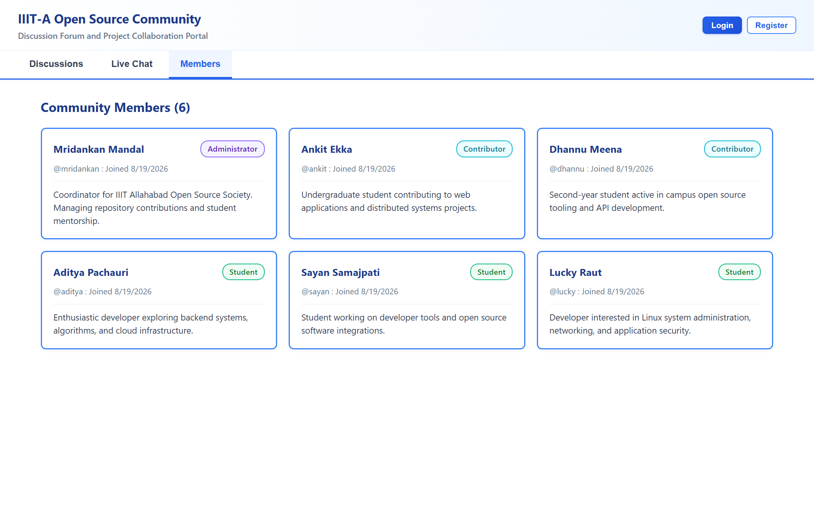

# IIITA Open Source Community Forum Version 2:

### Group Members:
1. Mridankan Mandal: IIB2024017.
2. Aditya Pachauri: IIB2024001.
3. Ankit Ekka: IIB2024012.
4. Dhannu Ram Meena: IIB2024033.

## 1. Project Overview:
1. This project represents Version 2 of the fullstack community discussion and chatting forum built for the IIIT Allahabad Open Source Community.
2. In this version, the Stored Cross Site Scripting vulnerability present in Version 1 has been completely mitigated through multilayered defense mechanisms.
3. The platform allows students, contributors, and faculty coordinators to safely publish posts, submit comments, and chat in realtime without security risks.

## 2. Implemented Defense Architecture:
1. Context Aware DOM Sanitization: Integration of `DOMPurify` library in client components to strip unauthorized script elements and malicious event handlers prior to DOM insertion.
2. Cookie Hardening: Setting the `HttpOnly` and `SameSite` strict attributes on authentication session cookies to block access from browser scripts.
3. Content Security Policy: Enforcement of HTTP Content Security Policy response headers on the Express server to prevent unauthorized inline script execution.

## 3. Technology Stack:
1. Backend: Node.js with Express framework for REST API routing and security middleware.
2. Database: Embedded SQLite 3 database using `node:sqlite` storing records in `server/forum.db`.
3. Frontend: React framework bundled via Vite with `DOMPurify` sanitization.
4. User Interface: Professional white theme with full colored card borders, custom role badges, and zero emojis.

## 4. Preconfigured Community Accounts:
1. Mridankan Mandal: Username is `mridankan` and password is `mridankan123` with `Administrator` role.
2. Ankit Ekka: Username is `ankit` and password is `ankit123` with `Contributor` role.
3. Dhannu Meena: Username is `dhannu` and password is `dhannu123` with `Contributor` role.
4. Aditya Pachauri: Username is `aditya` and password is `aditya123` with `Student` role.
5. Sayan Samajpati: Username is `sayan` and password is `sayan123` with `Student` role.
6. Lucky Raut: Username is `lucky` and password is `lucky123` with `Student` role.

## 5. Local Setup and Installation:
1. Prerequisites: Ensure Node.js version 18 or higher and npm are installed on the system.
2. Installation: Open terminal in this folder and execute:
```bash
npm install
```
3. Client Build: Compile frontend assets by executing:
```bash
npm run build
```
4. Start Application: Launch the server by executing:
```bash
npm start
```
5. Access Portal: Open `http://localhost:3000` in your web browser.

## 6. Visual Interface and Defense Verification:

### 6.1 Community Discussions Dashboard:

1. The main forum dashboard provides a clean overview of community discussions and category navigation.

### 6.2 Secured Discussion Thread:

1. Discussion posts render safely with strict sanitization applied across all user responses.

### 6.3 Neutralized XSS Attack Defense:

1. The DOMPurify engine sanitizes incoming markup before DOM insertion, completely neutralizing injected scripts and preventing unauthorized cookie access.

### 6.4 Realtime Community Chat Stream:

1. Community members communicate in realtime within protected chat channels protected by Content Security Policy headers.

### 6.5 Member Profiles Directory:

1. Public member profiles list community contributors, administrators, and students with isolated session cookies.

## 7. Security Defense Documentation:
1. Please inspect `XSSAttackDefense.md` for a detailed breakdown of all implemented defenses, source code references, and attack neutralization examples.
